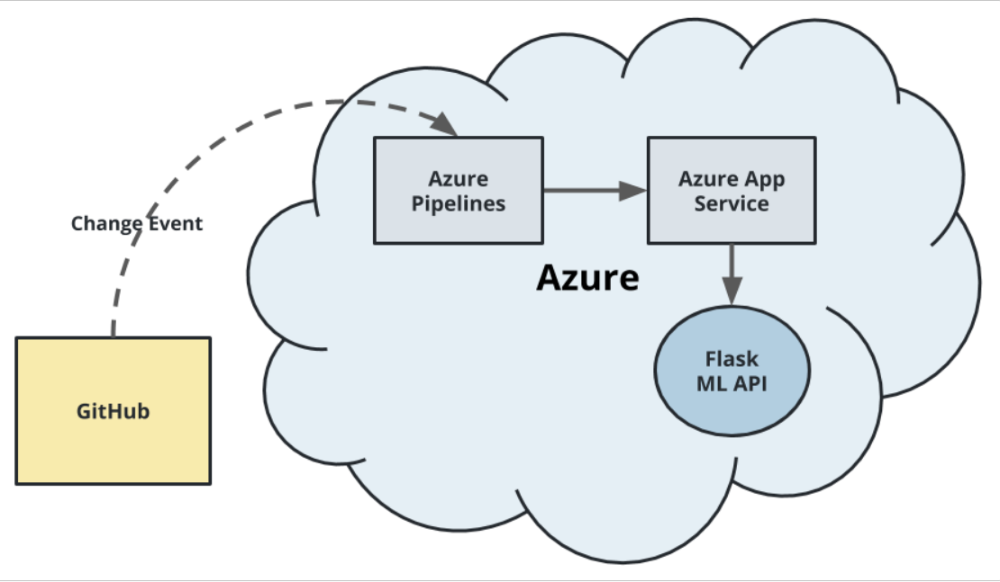
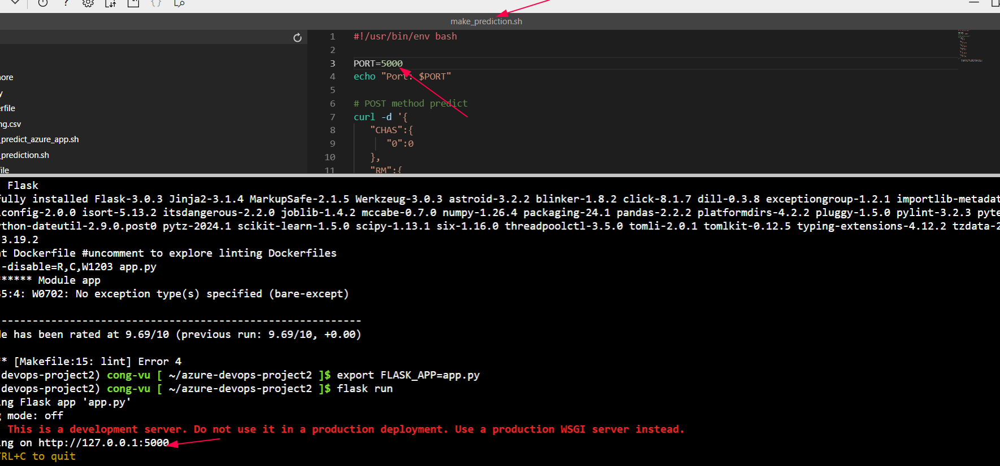
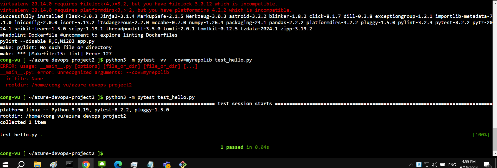

 
 
# Overview
 
* Udacity project
 
## Project Plan
 
* [Trello board](https://trello.com/invite/b/IyRqWRTC/ATTIad231052db6c3740aec7114cafb56c7790EB2D5F/azure-devops) DONE

* [Spreadsheet](https://docs.google.com/spreadsheets/d/17voUA4qipN7vUJ6PdpYlr36boVgCE79R/edit?usp=sharing&ouid=103544242828598678605&rtpof=true&sd=true) DONE
 
## Instructions

##step

* Architectural Diagram

Building step
* You need to clone your repo to CloudShell, then go to Deployment Center in Azure Webapp link your repo which contains the application

* Project running on Azure App Service

* Passing tests that are displayed after running the `make all` command from the `Makefile`

 #TO-DO
* Successful deploy of the project in Azure Pipelines.
#TO-DO

#TO-DO
* Successful prediction from deployed flask app in Azure Cloud Shell.

#TO-DO
* Output of streamed log files from deployed application

#TO-DO
* Successful deployment using Continuous Delivery on the Azure platform.

#TO-DO
* Successful running make all in CloudShell

## Enhancements
 
* Provide more GUI to the web application
 
#TO-DO
## Demo
Really sorry for my long video
[demo](https://www.youtube.com/)